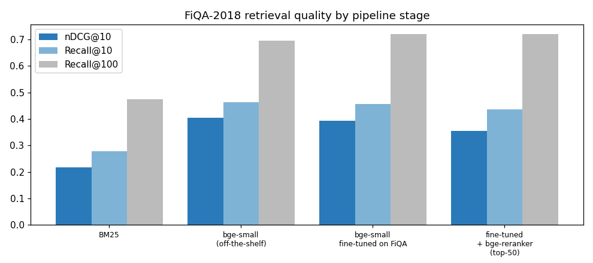

# 01 · RAG Retrieval, Measured: BM25 vs. Dense Embeddings vs. Fine-tuning vs. Cross-Encoder Reranking

In Retrieval-Augmented Generation the LLM can only be as good as the passages it receives — most RAG failures are retrieval failures. This project evaluates each stage of a typical retrieval pipeline **in isolation, on labelled data, before any LLM is involved**.

## Setup
| | |
|---|---|
| Task | financial question answering — **BEIR / FiQA-2018**: 648 test questions, 57,638 forum passages, human relevance labels |
| 1. Keyword | **BM25** (what Elasticsearch/OpenSearch do by default) |
| 2. Dense | **BAAI/bge-small-en-v1.5** (33 M params, 384-d) + **FAISS** exact inner-product index |
| 3. Fine-tuned | same model adapted on 14,166 FiQA *training* (question, answer) pairs with **Multiple-Negatives-Ranking loss** (in-batch negatives, InfoNCE-style), 3 epochs, 1.4 min on an A100 |
| 4. Reranked | **BAAI/bge-reranker-base** cross-encoder re-scores the top-50 candidates |
| Metrics | nDCG@10 (ranking quality), Recall@10 / Recall@100 (what an LLM prompt could ever contain), MRR@10 — implemented from scratch |

## Results (648 test questions)
| Pipeline | nDCG@10 | Recall@10 | Recall@100 | MRR@10 |
|---|---|---|---|---|
| BM25 | 0.217 | 0.278 | 0.474 | 0.270 |
| **bge-small (off-the-shelf)** | **0.403** | **0.464** | 0.696 | **0.488** |
| bge-small fine-tuned on FiQA | 0.393 | 0.456 | **0.720** | 0.472 |
| fine-tuned + bge-reranker (top-50) | 0.355 | 0.436 | 0.720 | 0.425 |



Latency: FAISS search **0.11 ms/query**; cross-encoder reranking of 50 candidates **305 ms/query** on an A100. Off-the-shelf bge-small's 0.403 nDCG@10 matches its published MTEB FiQA score, which validates the evaluation code.

## What the numbers say
1. **Dense retrieval nearly doubles quality over BM25** (+86 % nDCG@10). Financial questions and forum answers share meaning far more often than exact words.
2. **Fine-tuning raised deep recall (+2.4 pts Recall@100) but slightly lowered top-10 ranking.** 14k noisy forum pairs, 3 epochs and only in-batch *random* negatives taught the model to find more of the relevant passages but not to rank them better — and some general-purpose ranking ability was traded away. Fixes: mined **hard negatives** (BM25/dense top-k non-relevant passages), fewer epochs or a lower LR, or mixing general-domain pairs in to prevent forgetting.
3. **The reranker made things worse** (−0.038 nDCG@10) *and* costs ~2,700× more latency than the vector search. This is consistent with the BEIR benchmark, where MS-MARCO-trained cross-encoders under-perform strong dense retrievers on FiQA: web-search relevance ≠ financial-opinion relevance. A reranker is only worth it once it has been validated — or fine-tuned — on the target domain.

**Takeaway:** every stage of a RAG pipeline must earn its place with measurements on in-domain labelled data. Adding a fine-tuned retriever and a reranker "because best practice says so" would have made this system slower *and* worse at the top of the ranking.

## Run
```bash
pip install torch sentence-transformers datasets faiss-cpu rank-bm25
python 01_rag_retriever_finetuning/train.py          # ~15 min on an A100 (encoding 57k passages twice + reranking)
QUICK=1 python 01_rag_retriever_finetuning/train.py  # small smoke test
```
